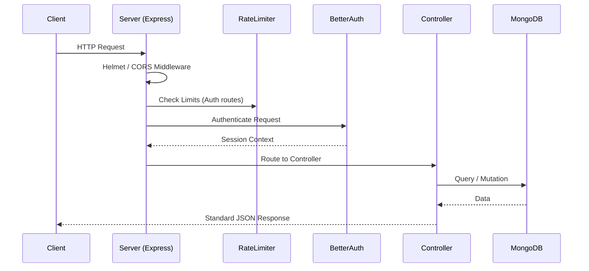

# ServiceHub Server

> The robust Express.js API backend powering the ServiceHub marketplace.


## Links & Demo Credentials

- **Live Website:** [ServiceHub](https://service-hub-client-tawny.vercel.app)
- **Frontend Repository:** [ServiceHub-client](https://github.com/Md-Nur-A-Alam/ServiceHub-client)
- **Backend Repository:** [ServiceHub-server](https://github.com/Md-Nur-A-Alam/ServiceHub-server)

### Demo Credentials (Customer)
- **Email:** `customer@gmail.com`
- **Password:** `Customer@123`

## Overview
ServiceHub Server is a scalable RESTful API built with Express and TypeScript. It serves as the backend engine for the ServiceHub client, handling core business logic, data persistence via MongoDB/Mongoose, robust authentication using Better Auth, and realtime event dispatching. 

## Table of Contents
- [Overview](#overview)
- [Tech Stack](#tech-stack)
- [Architecture](#architecture)
- [Folder Structure](#folder-structure)
- [Authentication](#authentication)
- [API Reference](#api-reference)
- [Database Schema](#database-schema)
- [Rate Limiting & Security](#rate-limiting--security)
- [Getting Started](#getting-started)
- [Available Scripts](#available-scripts)
- [Deployment](#deployment)
- [License & Author](#license--author)

## Tech Stack

| Category | Technology | Purpose |
| :--- | :--- | :--- |
| **Framework** | Express 5.2 | High-performance Node.js web application framework. |
| **Language** | TypeScript | Static typing and modern language features. |
| **Database** | MongoDB & Mongoose | NoSQL database and Object Data Modeling (ODM) library. |
| **Authentication** | Better Auth | End-to-end authentication handling with role-based access. |
| **Validation** | Joi | Schema description language and data validator for API payloads. |
| **Security** | Helmet & CORS | HTTP header security and Cross-Origin Resource Sharing. |
| **Realtime** | Pusher | Server-side event publishing for realtime client updates. |
| **Payments** | Stripe | Payment processing integration and webhook handling. |
| **Cache/Session** | Upstash Redis | Fast in-memory data store. |

## Architecture

The server utilizes a layered architecture ensuring separation of concerns:



**Standard Response Envelope**
All successful API responses follow a consistent format to ensure predictable client integrations. Errors are intercepted by a centralized error handler.

## Folder Structure

```text
src/
├── config/         # Database, Redis, and Better Auth configuration
├── controllers/    # Request handlers and business logic coordination
├── middlewares/    # Custom middlewares (auth, RBAC, error, rate-limit, upload)
├── models/         # Mongoose schemas and database models
├── routes/         # Express route definitions grouped by resource (v1)
├── services/       # Reusable business logic and external integrations
├── utils/          # Helper functions and custom error classes
└── validators/     # Joi validation schemas for request bodies
```

## Authentication

Authentication is fully managed by **Better Auth** mounted directly at `/api/auth/*`. 

Supported strategies include:
- Email/Password combination
- Google OAuth

Authentication utilizes a secure session/cookie strategy. Protected routes are guarded by RBAC (Role-Based Access Control) middlewares that verify the session cookie.

**Example Request:**
```javascript
// Fetching a protected resource using credentials
fetch("http://localhost:8000/api/v1/users/profile", {
  method: "GET",
  headers: {
    "Content-Type": "application/json"
  },
  credentials: "true" // Crucial for sending the Better Auth session cookie
})
.then(res => res.json())
.then(data => console.log(data));
```

## API Reference & Endpoints Visuals

Here is an overview of the protected and public endpoints tested:


The API is versioned under `/api/v1`. 

| Resource | Base Endpoint | Description |
| :--- | :--- | :--- |
| **Auth** | `/api/auth/*` | Handled by Better Auth (sign-in, sign-up, sessions). |
| **Services** | `/api/v1/services` | CRUD operations for service listings. |
| **Bookings** | `/api/v1/bookings` | Booking creation, status updates, and retrieval. |
| **Reviews** | `/api/v1/reviews` | Customer ratings and reviews for services. |
| **Users** | `/api/v1/users` | Profile management and user data retrieval. |
| **Payments** | `/api/v1/payments` | Stripe payment intents and webhooks. |
| **Favorites** | `/api/v1/favorites` | Customer saved/favorite services. |
| **Admin** | `/api/v1/admin` | Administrative overrides and analytics. |
| **Upload** | `/api/v1/upload` | File/image uploading routes. |

## Database Schema

The database utilizes Mongoose for schema definitions. (Note: The `User` collection is managed natively by Better Auth).

- **Service**: (`src/models/Service.ts`) - Details for a service listing, including title, descriptions, price, category, status (`pending`, `approved`, `rejected`), and provider ID.
- **Booking**: (`src/models/Booking.ts`) - Represents a transaction, storing `serviceId`, `customerId`, `providerId`, dates, time slots, payment tracking, and status (`pending`, `confirmed`, `completed`, `cancelled`).
- **Review**: (`src/models/Review.ts`) - Ratings and text feedback associated with a service and author.
- **Favorite**: (`src/models/Favorite.ts`) - Maps a user to a favorited service.
- **AuditLog**: (`src/models/AuditLog.ts`) - System logging for tracking critical actions and state changes.
- **Notification**: (`src/models/Notification.ts`) - In-app notification records for users.

## Rate Limiting & Security

- **Helmet**: Secures Express apps by setting various HTTP headers.
- **CORS**: Strictly configured to allow origins defined in `process.env.CLIENT_URL` and `localhost`/Vercel preview environments.
- **Rate Limiting**: `express-rate-limit` is applied specifically to sensitive authentication endpoints (`/api/auth/sign-in/email`, `/api/auth/sign-up/email`, `/api/auth/request-password-reset`) before processing.
- **Input Validation**: `Joi` is utilized across controllers to validate all incoming request bodies and parameters.

## Realtime Events

The server utilizes `pusher` to broadcast realtime events, enabling the client application to react instantly to state changes. Primary event streams include booking status updates and new notifications, allowing providers and customers to maintain synchronization without manual polling.

## Getting Started

### Prerequisites
- Node.js (v26.1.x)
- MongoDB running locally or a MongoDB Atlas URI
- Redis (via Upstash or local)

### Installation

1. Clone the repository:
   ```bash
   git clone https://github.com/yourusername/service-hub-server.git
   cd service-hub-server
   ```

2. Install dependencies:
   ```bash
   npm install
   ```

3. Environment Variables:
   Copy `.env.example` to `.env` and fill in the necessary keys.

### Environment Variables

| Variable | Description | Required | Example |
| :--- | :--- | :--- | :--- |
| `MONGODB_URI` | MongoDB Connection string | Yes | `mongodb://localhost:27017/ServiceHub` |
| `DB_NAME` | Database name | Yes | `ServiceHub_DB` |
| `BETTER_AUTH_SECRET` | Secret key used by Better Auth | Yes | `yoursecretkeyhere` |
| `BETTER_AUTH_URL` | Base URL for auth callbacks | Yes | `http://localhost:3000` |
| `SERVER_URL` | Self URL for internal references | Yes | `http://localhost:8000` |
| `CLIENT_URL` | Allowed CORS origin | Yes | `http://localhost:3000` |
| `GOOGLE_CLIENT_ID` | OAuth Client ID | No | `googleclientid` |
| `GOOGLE_SECRET_ID` | OAuth Secret | No | `googlesecretid` |
| `UPSTASH_REDIS_REST_URL` | Redis URL | Yes | `https://your-upstash-url.upstash.io` |
| `UPSTASH_REDIS_REST_TOKEN` | Redis Access Token | Yes | `your_redis_token` |

### Running the Server

```bash
npm run dev
```
The server will start at `http://localhost:8000` (or the port defined in your environment).

## Available Scripts

| Script | Description |
| :--- | :--- |
| `npm run dev` | Starts the server in watch mode using `tsx`. |
| `npm run build` | Compiles the TypeScript code into the `dist/` directory. |
| `npm run start` | Runs the compiled JavaScript server for production. |
| `npm run test` | Placeholder for test suite. |

## Deployment

The application is structured for typical Node.js environments (like Render, Heroku, or a VPS). To deploy, ensure that `npm run build` is executed and `node dist/server.js` is set as the start command.

## License & Author

Distributed under the ISC License. 


**Author:** Nur  
**GitHub:** [GitHub Profile](https://github.com/)  
**LinkedIn:** [LinkedIn Profile](https://linkedin.com/)
