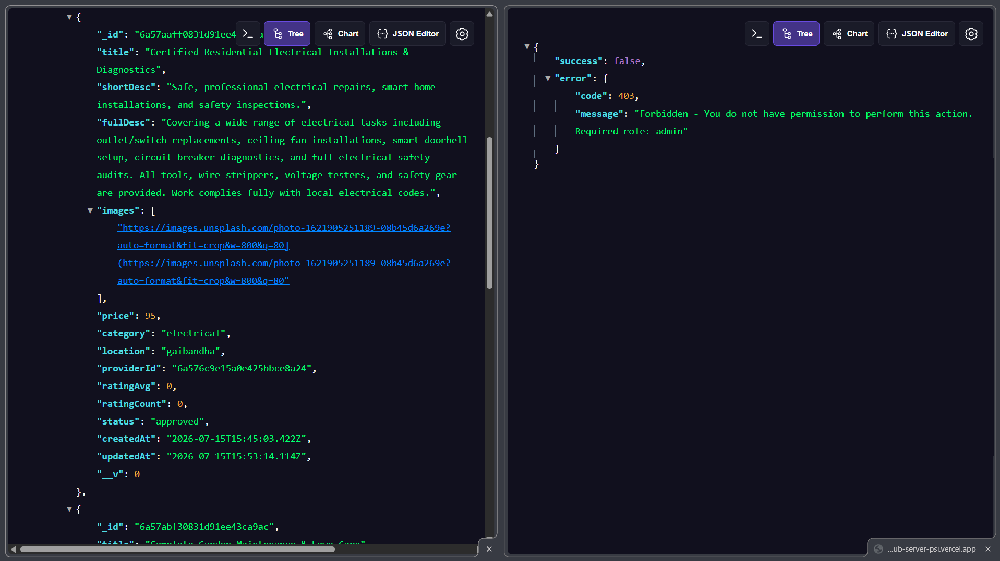
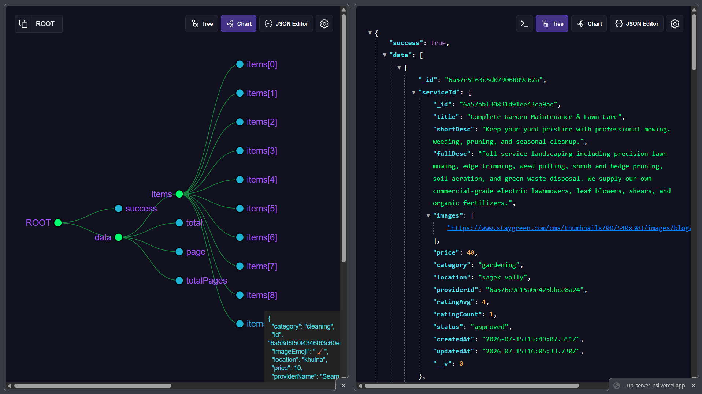
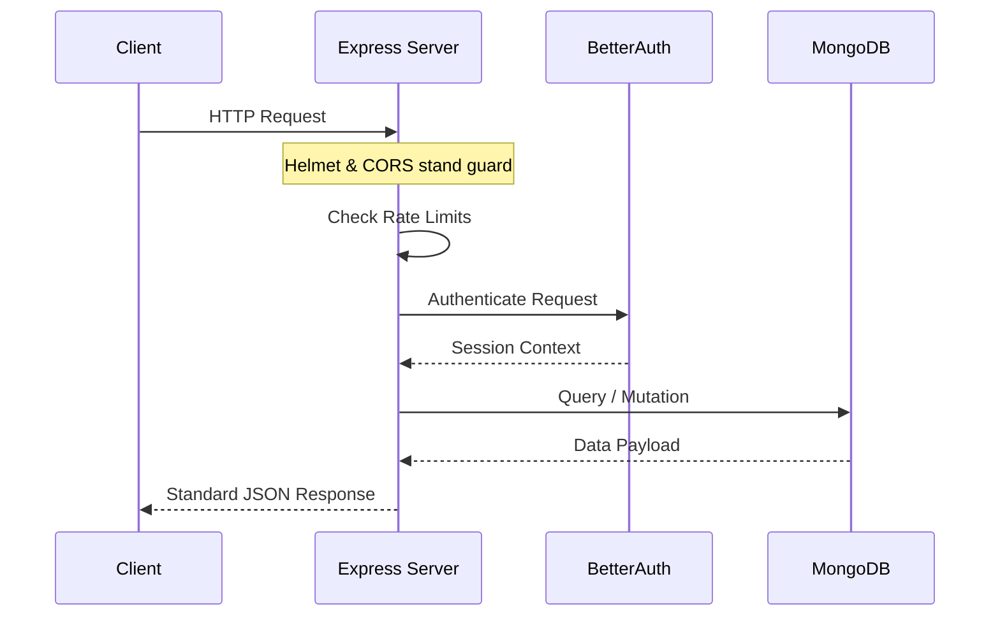

<div align="center">
  <h1>⚙️ ServiceHub Server</h1>
  <p><b>The robust Express.js API backend powering the ServiceHub marketplace.</b></p>
  <p><i>Because a gorgeous frontend without a backend is just a really pretty picture. 🖼️</i></p>

  
  
  
  
</div>

---

## 🔗 Links & Demo Credentials
Frontend getting all the glory? The backend does the heavy lifting. Test it out!

- 🌍 **Live Website:** [ServiceHub Frontend](https://service-hub-client-tawny.vercel.app)
- 🗄️ **Backend Repo:** [ServiceHub-server](https://github.com/Md-Nur-A-Alam/ServiceHub-server)
- 💻 **Frontend Repo:** [ServiceHub-client](https://github.com/Md-Nur-A-Alam/ServiceHub-client)

> **🔑 Magic Keys (Demo Customer)**  
> **Email:** `customer@gmail.com`  
> **Password:** `Customer@123`

---

## 🌟 Top Features & Highlights
The ServiceHub Server is built for scale, security, and developer sanity. Here are the core modules running the show:

<details>
<summary><b>🔐 Impenetrable Role-Based Access Control (RBAC)</b></summary>
<p>
We implemented a strict, unified middleware pipeline utilizing Better Auth. Before any request touches a sensitive controller, our RBAC middleware dynamically verifies session cookies, cross-references user roles (Admin vs Provider vs Customer), and rejects unauthorized mutations with standardized HTTP 403 errors.
</p>
</details>

<details>
<summary><b>🛡️ Rock-Solid Input Validation</b></summary>
<p>
Never trust the client. We use `Joi` validation schemas acting as a firewall on every single `POST`, `PUT`, and `PATCH` request. Invalid data shapes, missing fields, or weirdly formatted emails never even reach the database layer.
</p>
</details>

<details>
<summary><b>📡 Real-time Event Dispatcher</b></summary>
<p>
Pusher is tightly integrated into the core lifecycle. The moment a Mongoose transaction for a Booking updates from "pending" to "confirmed", an event is published to a secure WebSocket channel, instantly updating the relevant client UI.
</p>
</details>

<details>
<summary><b>🚀 Centralized Error Envelope</b></summary>
<p>
We created a custom `ApiError` class caught by a global error handler. Whether it's a Mongoose casting error, a JWT expiration, or a 404, the API guarantees a consistent JSON error envelope response shape, making frontend parsing extremely predictable.
</p>
</details>

---

## 🧠 Engineering Marvels (How We Solved the TRICKY Stuff)

Backend development is full of gotchas. Here are the specific, tricky issues we resolved during development:

> **🛑 The Problem: Serverless Database Connection Drops**
> *When deploying an Express app to serverless environments (like Vercel), cold starts and ephemeral instances mean standard "connect once on app boot" MongoDB strategies lead to dropped connections and timeouts.*
> 
> **✅ The Solution: Just-In-Time Connection Middleware**
> We bypassed standard bootstrapping and implemented a `Serverless-safe Database & Redis initialization middleware`. On every incoming request, it checks if a cached connection exists before proceeding. If a cold start occurs, it guarantees the DB and Upstash Redis are connected *before* `next()` is called.

> **🛑 The Problem: Better Auth + Express JSON Body Parser Conflicts**
> *Better Auth expects raw requests to handle its own form-data parsing, but standard Express setups globally mount `express.json()`, completely destroying the payload before Better Auth can read it.*
>
> **✅ The Solution: Strategic Route Mounting & Dynamic Imports**
> We mounted `app.all("/api/auth/*splat")` strictly **BEFORE** `express.json()`. Furthermore, we utilized `Function('modulePath', 'return import(modulePath)')` for a dynamic ESM import of `better-auth/node` to bypass strict CommonJS/ESM interop bundling issues in edge environments.

> **🛑 The Problem: Stripe Webhook Signature Verification**
> *Stripe requires the raw unparsed HTTP request buffer to verify webhook cryptographic signatures, but our API uses JSON.*
>
> **✅ The Solution: Targeted Raw Buffering**
> We added a specific line: `app.use("/api/v1/payments/webhook", express.raw({ type: "application/json" }));` right before the global JSON parser. This carves out an exception exclusively for Stripe.

---

## 🔌 API Endpoints & Protection Visuals
*We test our endpoints so you don't have to experience 500 Internal Server Errors.*

<details>
<summary><b>🛡️ Click to reveal: Review and Admin Analytics Protection</b></summary>
<br>

</details>

<details>
<summary><b>📅 Click to reveal: Service and Bookings Endpoints</b></summary>
<br>

</details>

### Interactive API Reference
All APIs live under `/api/v1`. 

<details>
<summary><b>📖 Click to Expand the Route Map</b></summary>

| Resource | Base Endpoint | What happens here? |
| :--- | :--- | :--- |
| **Auth** | `/api/auth/*` | Handled by Better Auth. Sessions, OAuth, Magic. |
| **Services** | `/api/v1/services` | The marketplace listings. |
| **Bookings** | `/api/v1/bookings` | Appointments and scheduling. |
| **Reviews** | `/api/v1/reviews` | Constructive criticism & 5-star praises. |
| **Users** | `/api/v1/users` | Profile data. |
| **Payments** | `/api/v1/payments` | Stripe webhooks (show me the money). 💰 |
| **Favorites** | `/api/v1/favorites` | Saved items. |
| **Admin** | `/api/v1/admin` | Dashboard analytics & god-mode overrides. 👑 |

</details>

---

## 🏗️ Architecture Visualization

A highly choreographed dance of requests, middlewares, and controllers.



---

## 🗃️ Database Schema

We use Mongoose schemas to keep our NoSQL slightly structured. *(Note: `User` is handled natively by Better Auth!)*

- **Service:** The things people buy (Title, price, provider ID, status).
- **Booking:** The transactions (Who, what, when, and payment intent).
- **Review:** The aftermath (Ratings and text).
- **Favorite:** Bookmarks for later.
- **AuditLog:** The *"Who did what and when"* tracker.
- **Notification:** Pinging users directly in the DB.

---

## 🔒 Security & Rate Limiting

- **Helmet:** Giving our Express app a helmet to protect against web vulnerabilities.
- **CORS:** We only talk to strangers we know (`CLIENT_URL` and `localhost`).
- **Rate Limiting:** `express-rate-limit` prevents brute-forcing on `/api/auth` routes. Stop trying to guess passwords!
- **Joi Validation:** If your JSON body doesn't match the schema, Joi sends you packing.

---

## 🚀 Run It Yourself (Getting Started)

<details>
<summary><b>⚙️ Server Ignition Sequence</b></summary>

1. **Clone the repo:**
   ```bash
   git clone https://github.com/Md-Nur-A-Alam/ServiceHub-server.git
   cd service-hub-server
   ```

2. **Install the node_modules black hole:**
   ```bash
   npm install
   ```

3. **Environment Variables:**
   Copy `.env.example` to `.env` and provide the keys to the kingdom. (MongoDB URI, Better Auth secrets, Stripe Keys, Upstash Redis).

4. **Fire it up:**
   ```bash
   npm run dev
   ```
   *Listening intently on `http://localhost:8000`...*
</details>

---

## 📜 License & Author

Distributed under the ISC License. Use it, break it, fix it, ship it.

<br>

<div align="center">
  
  <br/>
  <h3>Architected with ☕ and VS Code by Nur</h3>
  <a href="https://github.com/Md-Nur-A-Alam">GitHub</a> • <a href="https://www.linkedin.com/in/md-nur-a-alam13">LinkedIn</a>
</div>
